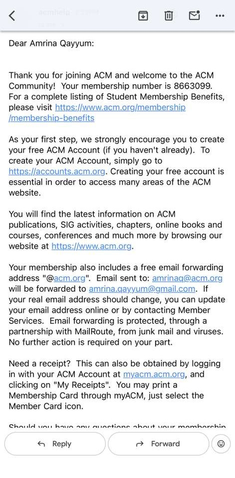
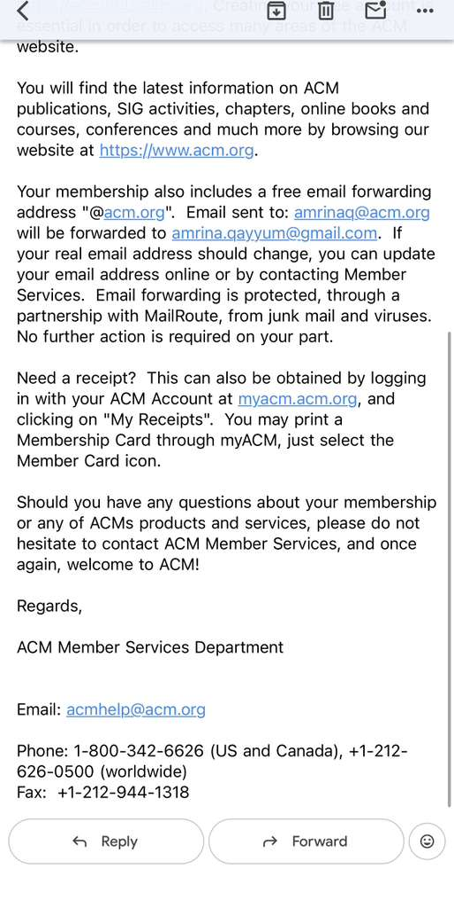
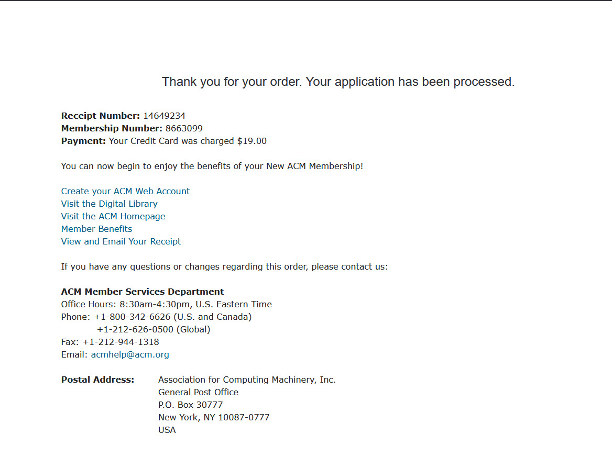
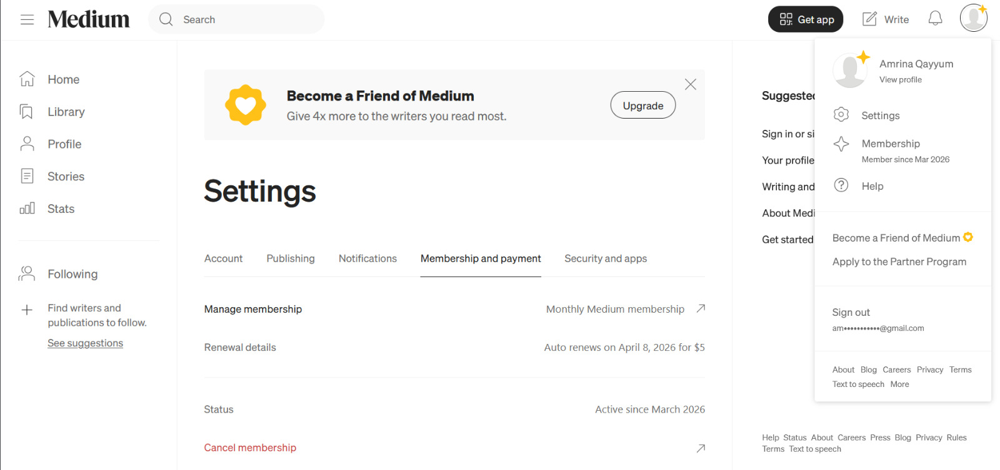

# CSCI331 Assignment
## Sign-up for ACM.org and Medium.com (Subscription)

### Student Information
Name: **Amrina Qayyum**  
Group: **PairProgrammingGroups**  
Group Name: **PPG_6**

---

# ACM Membership Proof

### ACM Membership Confirmation Email

### ACM Membership Confirmation Email 2

### ACM Membership Number Confirmation

---

# Medium Membership Proof

### Medium Membership Confirmation

---

# Full Proof Document

A compiled document containing all confirmations is also provided.

📄 **CSCI331_Sign-up-for-ACM.org-and-Medium.com (subscription) _Amrina Qayyum.pdf**

---

# Note
This repository contains proof of ACM and Medium membership as required for the CSCI331 group assignment.
